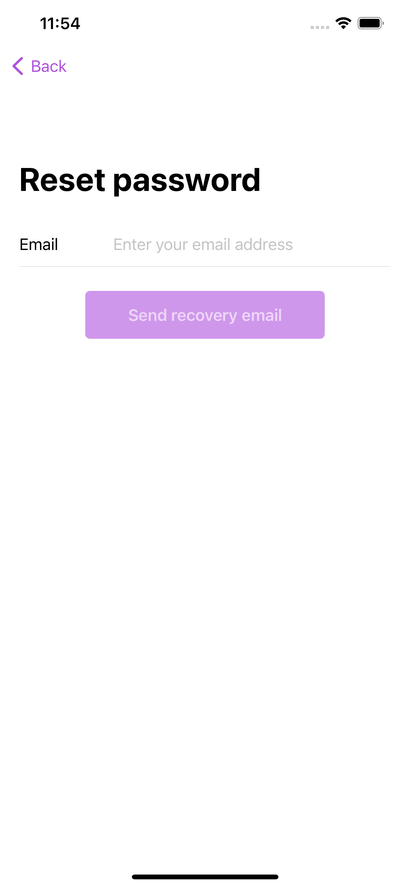
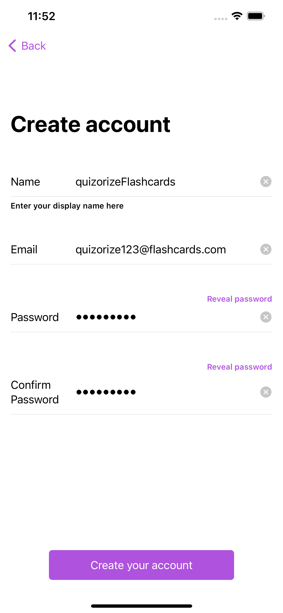

# Quizorize
## Overview
Quizorize is a gamified flashcard iOS application that aims to improve the learning and memorising experience of its users, leveraging on the use of 'Spaced Repetition' and 'Active Recall' studying techniques. 

This iOS application is targeted towards students aged 14 and above that wishes to leverage on good revision techniques to remember content taught in school. With a gamification features such as achievements and a leveling system, students are incentivised to spend more time on the app while ensuring productivity is met.

## Getting started

### Local Test (on your Mac)

To run quizorize locally, first clone this repository.

```bash
git clone https://github.com/remuskwan/quizorize.git
``` 

Then, run the following command in the root directory of the cloned repository

```bash
pod install
```

Open, the workspace file 'Quizorize.xcworkspace' to view the code and run its build.

### TestFlight (on iOS devices)

To receive your TestFlight code, please head over to this link [here](https://forms.gle/QB14gRb8jx5TJTKe8).

## Documentation

Please refer to our Milestone README [here](https://docs.google.com/document/d/1BBVJUarCBF2qy_ZWbH6zZka4ebhrtTBtQnHnmGUuizE/edit?ts=60afa18d).

## Launching the App

1. On the home screen of your iOS device (running on iOS 14.0 or later), tap the app icon
2. You will be presented with the Launch Screen of our app.
3. Pressing "Get Started." will bring you to the login page


<p align="left"></p>

## User Login
1. Type in your email address and password to login
2. You can click on 'Register' to create an account if you do not have one.
3. You may also sign in using your Apple or Google account
4. After successful login, you will be presented with the Homepage of our app.

  

## Registration
1. Type in your particulars into the text fields provided
2. Ensure that the validity checks of the fields are met
3. Create account

  

## Homepage ("Decks screen")
1. Currently "Work-in-Progress". Will house user-created collections of decks and decks of flashcards
2. Navigate to the "Profile" tab to sign out of your account.

## Profile
1. Currently "Work-in-Progress". Will show user's profile details as well as level and achievements.
2. Pressing the "gear" icon on the top-left of the screen will bring you to the settings screen
3. Pressing "Sign out" will sign you out of your account and bring you back to the Launch Screen

## Planned Features
1. Deck and Flashcard Creation
2. Preview mode (for viewing and editing flashcards) and Practice mode (for reviewing deck of flashcards)
3. Search (for collections, decks and flashcards)
4. Favoriting decks and flashcards (for ease-of-access)
5. Level and achievement system
6. Leaderboard system
7. Settings (to edit profile, app settings)

## Known Bugs
1. Sign in with Apple currently does not work as intended
2. If you are running Quizorize on a simulator from Xcode, the secure fields (Password and Confirm password) will sometimes show 'Strong Password' 
