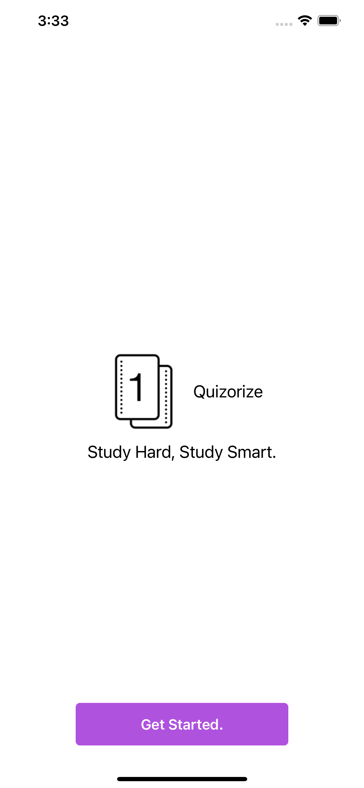

# Quizorize
## Overview
Quizorize is a gamified flashcard iOS application that aims to improve the learning and memorising experience of its users, leveraging on the use of 'Spaced Repetition' and 'Active Recall' studying techniques. 

This iOS application is targeted towards students aged 14 and above that wishes to leverage on good revision techniques to remember content taught in school. With a gamification features such as achievements and a leveling system, students are incentivised to spend more time on the app while ensuring productivity is met.

## Getting started

### TestFlight (on iOS devices)

Try the latest build of Quizorize by accessing this [link](https://testflight.apple.com/join/spPWRuor) on your iOS device.

Requirements: iPhone, iPad or iPod Touch running iOS 14.5 and later.

Recommended (for the best experience): iPhone or iPod Touch in Light Mode.

### Local Test (on your Mac)

1. To run quizorize locally, first clone this repository.

```bash
git clone https://github.com/remuskwan/quizorize.git
``` 

2. If you do not already have Cocoapods installed, run the following command (if not you can skip to Step 3)

```bash
sudo gem install cocoapods
```

3. Then, run the following command in the root directory of the cloned repository

```bash
pod install
```

You can refer to our walkthrough video which shows the steps above [here](https://youtu.be/-w0z_bnfsF8) 

Open, the workspace file 'Quizorize.xcworkspace' to view the code and run its build.

Requirements: Mac running macOS 11 BigSur, [Xcode 12](https://developer.apple.com/xcode/)

## Video Demo
Please visit our video demo on Youtube [here](https://youtu.be/EOlAkFIuFTw).

## Documentation

[Milestone II](https://docs.google.com/document/d/1BBVJUarCBF2qy_ZWbH6zZka4ebhrtTBtQnHnmGUuizE/edit?ts=60afa18d).
Milestone III.

## Launching the App

1. On the home screen of your iOS device, tap the app icon.
2. You will be presented with the Launch Screen of our app.
3. Pressing "Get Started." will bring you to the login page.


<p align="left"></p>

## User Login
1. Enter your email address and password to login. You may also sign in using your Apple or Google account.
2. You can click on 'Register' to create an account if you do not have one.
3. After successful login, you will be presented with the Homepage of our app.

 

## Registration
1. Enter your particulars into the text fields provided.
2. Ensure that the validity checks of the fields are met.
3. Create account.

 

## Homepage ("Decks screen")
1. Houses user-created decks, which can be accessed from any of the user's devices on which they are logged-in
2. Users can create new decks by tapping the "New" icon.
3. Users can access a deck's preview screen by tapping on its icon.
4. Users can edit a deck or delete a deck by tapping on its title.
5. Tapping the bell icon on the top left of the page will bring up the Activity page, which is currently work-in-progress. It will house the user's notifications and reminders to revise their decks according to the spaced repetition algorithm.

## Deck Creation
1. Tap "New" to create a new deck.
2. Enter the deck's title and the flashcards' prompts and answers. Each deck must contain a minimum of two flashcards. 
3. Swipe left on a flashcard to remove it from the deck.
4. Tap "Create" to finish creating the deck.

 

## Deck Preview
1. The deck's flashcards are displayed in a carousel. 
2. Tap a flashcard to flip it (prompt on the front, answer on the back).
3. Swipe left and right to navigate between flashcards.

 

## Practice Mode
1. Tap "Practice" in Preview to access Practice Mode.
2. Practice Mode can be configured based on whether the user wants to be reminded to practice the deck again, at a time determined using the app's Spaced Repetition algorithm
3. The deck of flashcards are displayed as an interactive deck.
4. Tap a flashcard to flip it (prompt on the front, answer on the back).
5. Swipe left or right to navigate to the next flashcard. The counter and progress bar increments with each swipe.
6. Tapping the optional "Shuffle" button shuffles the deck of flashcards
7. A summary screen is shown when "Practice" is complete. Tapping the "Reset" button resets the page.
8. If Spaced Repetition reminders were turned on, the user is instructed to practice a second time. Afterwhich, the app calculates the next study date for the user and sends them a push notification on that date.
9. Tap the "X" in the top left corner to exit Practice mode.

 

## Test Mode
1. Tap "Test" in Preview to access Test Mode.
2. Test Mode can be configured based on the user's desired question types (True or false, Multiple choice and Written) and whether they want to be reminded to take the test again.
3. Tap "Start Test" to start Test Mode.
4. True or false: A random answer from the list of flashcards is displayed alongside a flashcard's prompt. If the answer to the prompt is correct and "True" is selected, or if the answer to the prompt is incorrect and "False" is selected, the question would be considered to have been answered correctly.
5. Multiple choice: Up to 4 random options are displayed alongside a flashcard's prompt. If the option selected is the correct answer to the prompt, the question would be considered to have been answered correctly.
6. Written: If the correct answer to the prompt displayed is entered, the question would be considered to have been answered correctly.
7. A summary screen containing the user's score (percentage of correct answers to total questions) is displayed at the end of the test. Tapping the "Retake" button resets the test.
8. Tap the "X" in the top left corner to exit Test mode.
9. If Reminders were turned on, a push notification will be sent to the user at their chosen time.

## Search
1. Tap the "Search" icon in the tab bar to access the Search page.
2. Enter a deck's title into the search field to search for a deck.
3. Tap on the deck's icon to view its preview screen.

 

## Profile
1. User can change their email or password.
2. Pressing "Sign out" will sign the user out of their account and bring them back to the Launch Screen.

## Future
1. Favoriting decks and flashcards (for ease-of-access)
2. Level and achievement system
3. Leaderboard system

## Known Bugs
1. If you are running Quizorize on a simulator from Xcode, the secure fields (Password and Confirm password) will sometimes show 'Strong Password'.
2. Does not fully support "Dark" appearance.
3. Launch screen on iPad appears in the sidebar.
