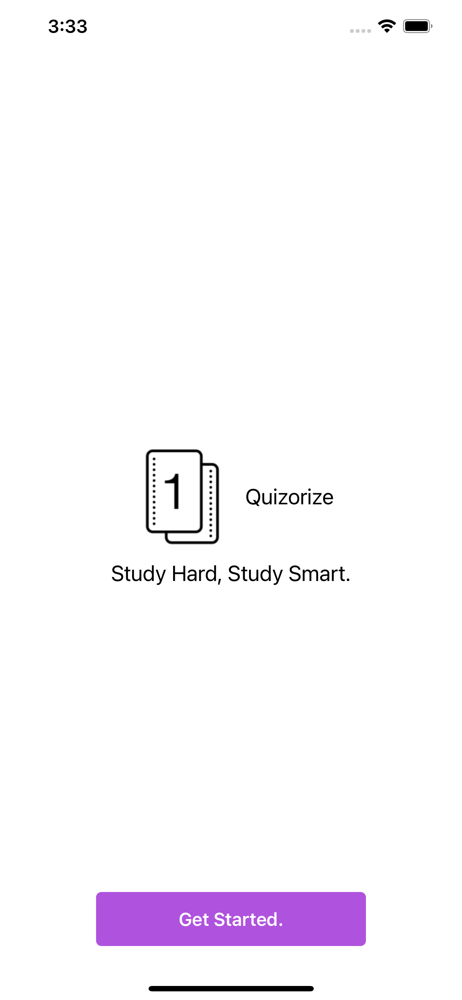
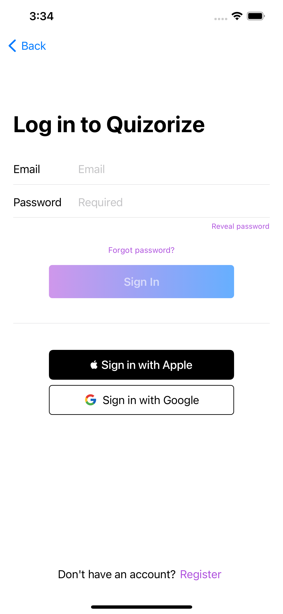
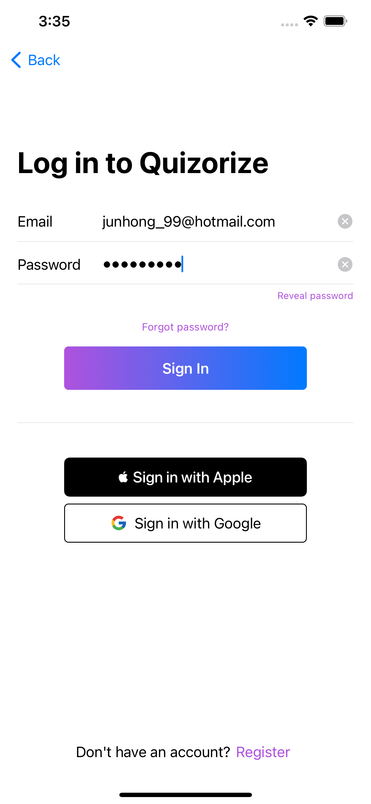
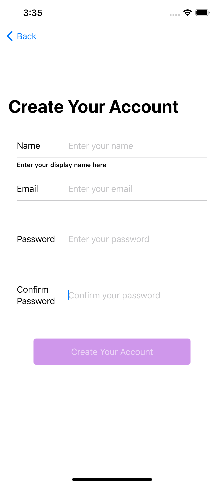
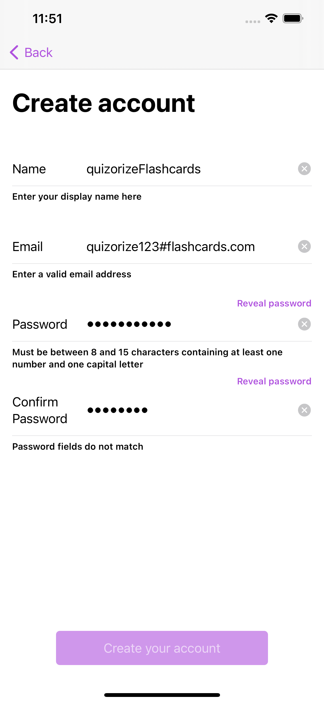

# Quizorize
## Overview
Quizorize is a gamified flashcard iOS application that aims to improve the learning and memorising experience of its users, leveraging on the use of 'Spaced Repetition' and 'Active Recall' studying techniques.

This iOS application is targeted towards students aged 14 and above that wishes to leverage on good revision techniques to remember content taught in school. With a gamification features such as achievements and a leveling system, students are incentivised to spend more time on the app while ensuring productivity is met.

## Getting started

To run quizorize locally, first clone this repository.

```bash
git clone https://github.com/remuskwan/quizorize.git
``` 

Then, run the following command in the root directory of the cloned repository

```bash
pod install
```

Open, the workspace file 'Quizorize.xcworkspace' to view the code and run its build.

## Documentation

Please refer to our Milestone README [here](https://docs.google.com/document/d/1BBVJUarCBF2qy_ZWbH6zZka4ebhrtTBtQnHnmGUuizE/edit?ts=60afa18d)

## Launching the App

1. On the home screen of your iOS device (running on iOS 14.0 or later), tap the app icon
2. You will be presented with the Start View of our app.

<p align="left"></p>

## User Login
1. Type in your email address and password to login
2. You can click on 'Register' to create an account if you do not have one.

 

## Registration
1. Type in your particulars into the text fields provided
2. Ensure that the validity checks of the fields are met
3. Create Account

 

